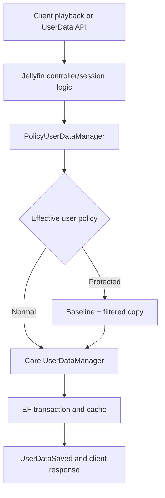

# Architecture

## Scope

Private Playback 0.9.0 controls the four playback-related columns in Jellyfin 10.11.11 core UserData without modifying Jellyfin binaries, jellyfin-web, the database schema or client applications. It stores only versioned per-user policy configuration; it has no playback-event store.

## Registration

`PluginServiceRegistrator` uses Jellyfin's public `IPluginServiceRegistrator` hook after core services have been registered and before the service provider is built. It decorates `IUserDataManager` only when:

1. `IServerApplicationHost.ApplicationVersion` equals `10.11.11.0`;
2. exactly one `IUserDataManager` descriptor exists;
3. it is a singleton implemented by `Emby.Server.Implementations.Library.UserDataManager`;
4. that implementation comes from `Emby.Server.Implementations` version `10.11.11.0`.

If any check fails, the core descriptor remains untouched, maintenance endpoints return conflict, and `EnforcementStatus` explains that protection is inactive. This prevents a build from pretending to work after ABI drift or another service replacement.

## Data flow

Jellyfin obtains a mutable `UserItemData` before calculating start/progress/stop or manual watched changes. For a protected user, `GetUserData` returns a clone rather than the core cache object. Core logic can therefore calculate normally without modifying the committed baseline in memory.

At `SaveUserData` the decorator:

1. performs an allocation-free dictionary policy lookup;
2. enters one of 512 fixed lock stripes keyed by `(UserId, ItemId)`;
3. reads the current committed/cache baseline from the original manager;
4. clones the candidate and restores each protected field from the baseline;
5. compares every persisted UserData property;
6. delegates exactly one write only if an allowed value changed.

The core still owns validation, EF mapping, transaction, cache rehydration and `UserDataSaved`. A write containing only prohibited changes is skipped, so no forbidden intermediate database value or post-save reset window exists.

## Policy model

`PolicyRegistry` publishes a defensive dictionary copy with `Volatile.Write`; readers use `Volatile.Read`. A configuration update is therefore observed as one complete immutable-by-convention snapshot.

| Policy concept | Protected fields | Derived effects |
| --- | --- | --- |
| Remember progress | `PlaybackPositionTicks` | resume percentage and Continue Watching |
| Remember watched | `Played` | item/season/series watched indicators |
| Record history | `PlayCount`, `LastPlayedDate` | history ordering and Next Up inputs |

`Fully private` protects all three concepts. Configuration changes apply to the next UserData operation. Values committed before activation remain pre-existing data and are not silently deleted.

## Manual watched enforcement

`POST /UserPlayedItems/{itemId}`, `DELETE /UserPlayedItems/{itemId}`, their legacy user-qualified forms, folder-recursive operations and `POST /UserItems/{itemId}/UserData` all reach `IUserDataManager` in 10.11.11. The same pre-transaction filter therefore covers both automatic playback and direct/manual API changes.

When watched state is protected, `Played` is restored to its baseline. With full privacy, the play-count/date/position side effects of `BaseItem.MarkPlayed` or `MarkUnplayed` are restored too. Multiple sessions see the committed baseline because filtering and maintenance share the striped lock.

There is no supported plugin contract to hide watched controls per user in all Jellyfin clients. Server enforcement is authoritative; the project does not patch or inject client code.

## Existing-data maintenance

The elevated controller routes are:

- `GET /PrivatePlayback/Users/{userId}/PlaybackData/Preview`;
- `POST /PrivatePlayback/Users/{userId}/PlaybackData/Clear` with exact confirmation `CLEAR_PLAYBACK_DATA`.

`PlaybackDataMaintenance` resolves one real Jellyfin user and enumerates only non-folder video, audio and book items. Preview and clear call the decorator's maintenance methods, which use the same `(user,item)` lock as playback. Clear copies the baseline, resets the four playback fields and delegates through the captured original manager so an active policy cannot block the administrator's explicit deletion.

Cancellation is checked between items and inside each lock. Partial failure leaves already cleared records valid; retry is idempotent. Favourites, rating, audio/subtitle indexes and all account/security data are retained.

## Concurrency and lifecycle

- There is no global hot-path lock. Hash collisions can serialize unrelated items within one of 512 stripes but never create an unbounded lock table.
- Locks contain synchronous cache/database calls already defined by Jellyfin's synchronous `IUserDataManager`; no `await`, external I/O or callback is introduced by the plugin.
- Duplicate and out-of-order saves cannot change protected fields; allowed fields follow Jellyfin's original last-write behaviour.
- Policy snapshots do not retain item IDs or session data.
- There is no timer, queue, hosted worker or shutdown drain.
- Removal of the plugin restores the original core registration on the next server process; no schema or binary remains required.

## Fail-safe behaviour

Configuration is rejected for a null list, duplicate/empty user ID, unknown mode, more than 2,048 entries, display names longer than 256 characters, or unsupported schema. Startup deserialisation errors publish an empty registry and log a technical error without item/user playback details.

Policy lookup failure returns `PlaybackPolicy.Normal`. The unexpected absence of a core baseline logs a warning and delegates the original request unchanged. Cancellation remains cancellation. Exceptions thrown by the underlying core service are not falsely hidden or retried as plugin successes.

This fail-safe favours server availability and data integrity over silently assuming privacy. Administrators must inspect the active status before relying on protection.

## Security and privacy properties

- Custom controller endpoints require Jellyfin's `RequiresElevation` authorization policy.
- User identity comes from Jellyfin's authenticated `User` passed to the core call; configuration is keyed by immutable `Guid`.
- The UI uses fixed resource keys, `textContent`, `replaceChildren` and URL-encoded IDs; it never evaluates or inserts untrusted HTML.
- The plugin makes no network request and accepts no path or URL input.
- Logs contain no item title, item ID, playback position, token, password or authorization header.
- Authentication/security logs and account controls are outside the decorated service and remain operational.

## Other plugins

The decorator forwards the original `UserDataSaved` event when an allowed change produces a real core write. It intentionally does not suppress `ISessionManager` playback events. Playback Reporting, Webhook and Trakt can therefore continue working and can independently record private-user activity. Their stores are outside this plugin's control and must be configured separately.
