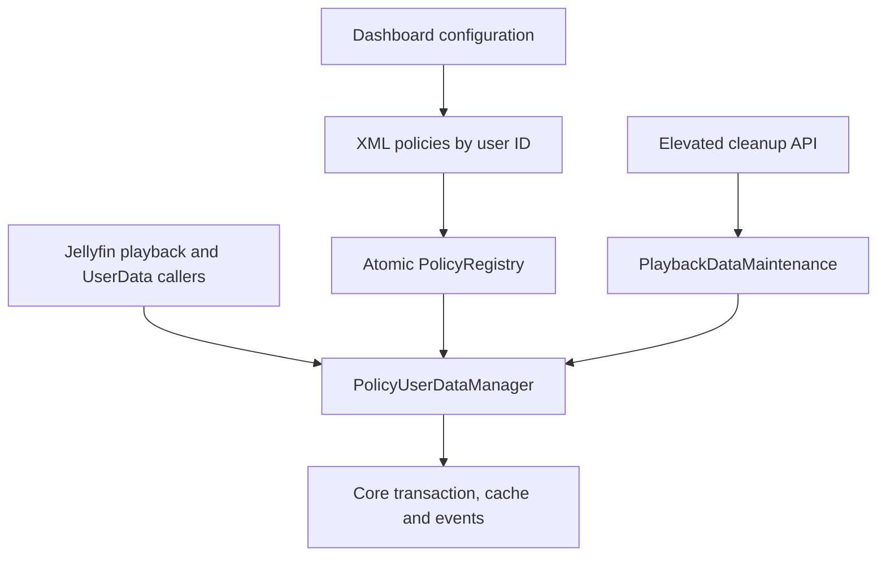

# Private Playback design

## Product status and target

- Working name: **Private Playback**.
- Initial maturity: `0.9.0` beta. The real 10.11.11 installation, restart and persistence suite passes, while physical-client, media-delivery, third-party co-installation and SonarQube Gate validation remain open.
- Sole declared target: Jellyfin Server `10.11.11` (`1fbd8739292cce610231be93daf43368733edf63`).
- Runtime and target framework: .NET 9 / `net9.0`.
- This is an independent, unofficial Jellyfin plugin.

## Requirements

The plugin must provide per-user policies, preserve normal playback, prevent selected playback fields from changing persistently, enforce manual watched changes server-side, preserve unrelated UserData, keep security logging intact, and fail back to unmodified Jellyfin behaviour when it cannot initialise safely.

The maximum-privacy preset protects:

1. resume position (`PlaybackPositionTicks`);
2. watched state (`Played`);
3. play history (`PlayCount` and `LastPlayedDate` as one consistency group).

Custom mode exposes exactly these three concepts. It does not expose derived DTO fields or database implementation details.

## Non-requirements

- Hiding or altering watched buttons in Jellyfin clients.
- Suppressing authentication, security, activity or diagnostic logs.
- Preventing another plugin from recording session events in its own database or remote service.
- Patching Jellyfin core, jellyfin-web, binaries, static assets or `jellyfin.db` directly.
- Storing a replacement playback-history database.
- Claiming compatibility with any server version other than 10.11.11.

## Alternatives considered

| Alternative | Decision | Reason |
| --- | --- | --- |
| Listen to playback events and reset afterwards | Rejected | Events are published after persistence; creates race/crash windows and loses the exact previous baseline |
| Subscribe to `UserDataSaved` and reset | Rejected | The event is post-commit and the cached object is already mutated |
| Periodic cleanup task | Rejected | Largest privacy window, repeated I/O, no crash guarantee |
| Replace endpoints with plugin routes | Rejected | Official and third-party clients would continue using core routes; legacy/generic routes create bypasses |
| Modify jellyfin-web or inject JavaScript | Rejected | Unsupported, client-specific and expressly outside scope |
| Write SQL triggers or edit `jellyfin.db` | Rejected | Core-private schema coupling and corruption risk |
| Decorate the public `IUserDataManager` service | Selected | Single path covers playback and manual APIs and can sanitise values before the transaction |

## Component model

## Registration and fail-safe behaviour

`IPluginServiceRegistrator` inspects the exact service descriptor present after Jellyfin 10.11.11 core registration. Decoration occurs only when all of the following are true:

- there is exactly one effective `IUserDataManager` descriptor;
- its lifetime is singleton;
- its concrete implementation is the expected `Emby.Server.Implementations.Library.UserDataManager`.

The original descriptor is captured, removed and constructed inside the decorator factory. No compile-time reference to the private concrete implementation is used.

If the descriptor differs—because the server version changed or another plugin replaced it first—the plugin leaves it untouched. Its status endpoint reports enforcement unavailable and its policy registry remains inert. Jellyfin retains normal behaviour.

Invalid, corrupt or future-version configuration produces an empty policy snapshot: no user's UserData is modified. Configuration errors are logged without media names, tokens or playback details.

## Policy data model

Each entry stores:

- stable `UserId` (`Guid`);
- last known display name, solely for an understandable stale entry in the admin page;
- mode: Normal, Full private, or Custom;
- the three custom retention booleans.

Preset normal resolves all retention values to true. Full private resolves all to false. Custom uses the stored values. Duplicate IDs, empty IDs, excessive entries and unknown schema versions are rejected from the active snapshot. Renaming a user has no effect because lookups use only `UserId`. Deleted users remain visible as stale configuration entries until an administrator removes them.

## Hot path

The registry publishes an immutable dictionary snapshot through an atomic reference. A normal user costs one dictionary lookup and a direct delegate call. No database query, allocation, timer or reflection is used for a normal user.

For a protected user, `GetUserData` returns a field-for-field copy. This is essential: Jellyfin's core mutates the object returned by `GetUserData` before calling `SaveUserData`, while the original manager caches that object by reference.

At save time the decorator uses a fixed set of striped locks. Inside one stripe it:

1. fetches the unchanged current baseline from the original manager;
2. copies the candidate value;
3. replaces protected playback fields with baseline values;
4. compares all persisted fields;
5. skips the original write if nothing allowed changed, otherwise saves once.

The lock includes the synchronous original save because `IUserDataManager` exposes no transaction or compare-and-swap contract. This is a deliberate narrow exception to the preference against holding locks across I/O: releasing it earlier would permit lost updates between two private sessions. Stripes are fixed-size, contain no media identifiers, and prevent unbounded history-like memory growth.

## Granular semantics

| Setting | Protected fields | Direct effects |
| --- | --- | --- |
| Remember resume progress | `PlaybackPositionTicks` | Continue Watching and progress bars |
| Remember watched state | `Played` | watched badge, automatic/manual watched changes, season/series aggregate state, Next Up sequencing |
| Record play history | `PlayCount`, `LastPlayedDate` | play count, last played, history sorting and Next Up series ordering |

Combinations are internally consistent because each persisted field always comes either wholly from the last committed baseline or wholly from the candidate operation. `PlayCount` and `LastPlayedDate` cannot be split.

Full private blocks all three groups. It still permits favourites, ratings and remembered audio/subtitle stream indexes. If a progress event changes only protected fields, no row is written and no `UserDataSaved` event is emitted. If it also changes an allowed stream preference, one row may exist, but all four playback fields remain at their prior values.

## Manual watched enforcement

Both dedicated watched/unwatched endpoints, their legacy variants, folder recursion and the generic UserData endpoint eventually call `IUserDataManager`. The decorator therefore applies the policy before the core transaction regardless of client.

For a user whose watched state is protected, a manual request preserves the prior `Played` value. With full private it also preserves position and history. The API subsequently reads back the committed baseline through the same manager, so its response reflects the enforced state.

The client may optimistically change its icon before processing the server result. No supported Jellyfin 10.11.11 plugin hook exists to remove that control per user; the server remains authoritative.

## Pre-existing data and policy changes

Enabling a policy does not delete or zero existing data. Every protected field is restored from the current committed baseline, including a pre-existing watched state or progress position.

A separate elevated cleanup operation is available only after explicit confirmation. It clears the four playback fields while preserving favourite, rating and stream preferences. It is idempotent. It never edits passwords, permissions, devices, authentication data, logs or another user.

Changing policy during playback takes effect at the next UserData operation. Any write committed before the policy change is pre-existing data and is not silently reversed. An administrator can use the explicit cleanup action if that is desired.

## Concurrency

- Policy snapshots are immutable and swapped atomically.
- The decorator uses fixed striped locks keyed by user and item IDs for baseline-plus-save atomicity.
- No asynchronous continuation occurs inside a lock.
- No session state, item name, playback position or timestamp is retained by the plugin.
- Duplicate progress, stop, manual watched and cleanup operations are idempotent with respect to protected fields.
- Different users remain isolated because every lookup and baseline is keyed by the concrete `User` passed by Jellyfin.
- On shutdown there is no queue or delayed cleanup to drain.

## Threat model

| Threat | Control |
| --- | --- |
| Direct calls to watched or generic UserData APIs | Enforcement below controllers at `IUserDataManager` |
| Non-admin policy changes or cleanup | Jellyfin `RequiresElevation` policy and built-in plugin configuration authorization |
| Forged user ID in cleanup | Resolve the exact user; operate only on that instance; explicit matching confirmation |
| XSS from user names | Admin UI writes names using `textContent`, never `innerHTML` |
| JSON/HTML injection | Fixed resource keys; `JSON.parse`; no generated markup containing untrusted strings |
| DoS through huge configuration | Hard maximum entry count, duplicate/empty-ID validation |
| Race causing protected value to leak | Pre-transaction sanitisation plus striped atomic section |
| Sensitive logging | No item IDs/names, positions, tokens or authorization headers in plugin logs |
| Core-version drift | Exact NuGet pins and descriptor-shape refusal |
| Another decorator/plugin conflict | Refuse activation when the expected core descriptor is not present |

The plugin makes no outbound requests during normal operation.

## Cleanup design

Preview and cleanup enumerate library items through `ILibraryManager`, inspect the selected user's data, and count only records with a non-default playback field. Cleanup writes a copy with position zero, count zero, date null and watched false through the captured original manager. All unrelated fields are copied unchanged.

The action requires an elevated token, the exact selected user ID in the constrained route and an explicit request-body confirmation value. Cancellation is checked between items. A failure stops the operation and returns an error; already-cleared records remain consistently cleared, and retry is safe.

## Localisation and accessibility

The HTML contains semantic headings, associated labels, status regions and standard Jellyfin controls. User cards are generated with DOM APIs. The UI is keyboard-operable and does not encode meaning by colour alone.

Nine JSON dictionaries contain identical, non-empty keys: `en-GB`, `es-ES`, `pt-PT`, `fr-FR`, `it-IT`, `zh-TW`, `ja-JP`, `ru-RU` and `ko-KR`. The locale loader reads `document.documentElement.lang`, normalises case/separators and selects exact or language-family matches. Every failure path uses the complete `en-GB` dictionary.

## Rollback and uninstall

The plugin never changes schema and creates no history store. Disable/uninstall followed by a server restart restores the original core registration. Existing Jellyfin UserData—whether pre-existing or explicitly cleaned—remains valid. No automatic deletion occurs on uninstall.

## Test strategy

1. Pure unit tests for policy normalisation, cloning, field sanitisation, DTO update paths, isolation and concurrency.
2. Resource tests for identical localisation keys, non-empty values and UTF-8/CJK/Cyrillic content.
3. API/runtime tests against a fresh Jellyfin 10.11.11 data directory using generated media.
4. Restart checks for normal and private users.
5. Direct watched endpoint, generic UserData endpoint and concurrent-session checks.
6. Package install, removal and server smoke tests.
7. Debug/Release builds with warnings as errors, dependency audit, secret scan and Sonar analysis where infrastructure is available.

All runtime reports distinguish VERIFIED, INFERRED and NOT VERIFIED. A test plan is not evidence that a test passed.
